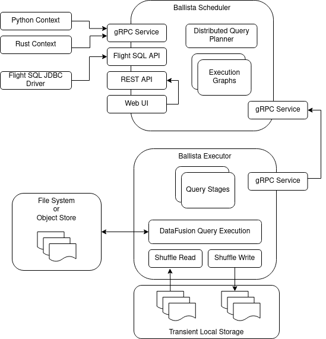
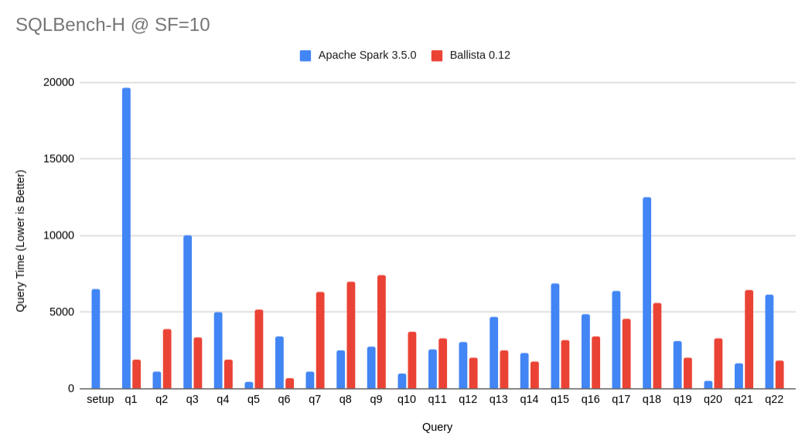

<!---
  Licensed to the Apache Software Foundation (ASF) under one
  or more contributor license agreements.  See the NOTICE file
  distributed with this work for additional information
  regarding copyright ownership.  The ASF licenses this file
  to you under the Apache License, Version 2.0 (the
  "License"); you may not use this file except in compliance
  with the License.  You may obtain a copy of the License at

    http://www.apache.org/licenses/LICENSE-2.0

  Unless required by applicable law or agreed to in writing,
  software distributed under the License is distributed on an
  "AS IS" BASIS, WITHOUT WARRANTIES OR CONDITIONS OF ANY
  KIND, either express or implied.  See the License for the
  specific language governing permissions and limitations
  under the License.
-->

# Ballista: Distributed SQL Query Engine, built on Apache Arrow

Ballista is a distributed SQL query engine powered by the Rust implementation of [Apache Arrow][arrow] and
[Apache Arrow DataFusion][datafusion].

If you are looking for documentation for a released version of Ballista, please refer to the
[Ballista User Guide][user-guide].

## Overview

Ballista implements a similar design to Apache Spark (particularly Spark SQL), but there are some key differences:

- The choice of Rust as the main execution language avoids the overhead of GC pauses and results in deterministic
  processing times.
- Ballista is designed from the ground up to use columnar data, enabling a number of efficiencies such as vectorized
  processing (SIMD) and efficient compression. Although Spark does have some columnar support, it is still
  largely row-based today.
- The combination of Rust and Arrow provides excellent memory efficiency and memory usage can be 5x - 10x lower than
  Apache Spark in some cases, which means that more processing can fit on a single node, reducing the overhead of
  distributed compute.
- The use of Apache Arrow as the memory model and network protocol means that data can be exchanged efficiently between
  executors using the [Flight Protocol][flight], and between clients and schedulers/executors using the
  [Flight SQL Protocol][flight-sql]

## Architecture

A Ballista cluster consists of one or more scheduler processes and one or more executor processes. These processes
can be run as native binaries and are also available as Docker Images, which can be easily deployed with
[Docker Compose](https://arrow.apache.org/ballista/user-guide/deployment/docker-compose.html) or
[Kubernetes](https://arrow.apache.org/ballista/user-guide/deployment/kubernetes.html).

The following diagram shows the interaction between clients and the scheduler for submitting jobs, and the interaction
between the executor(s) and the scheduler for fetching tasks and reporting task status.

See the [architecture guide](docs/source/user-guide/architecture.md) for more details.

## Features

- Supports HDFS as well as cloud object stores. S3 is supported today and GCS and Azure support is planned.
- DataFrame and SQL APIs available from Python and Rust.
- Clients can connect to a Ballista cluster using [Flight SQL][flight-sql].
- JDBC support via Arrow Flight SQL JDBC Driver
- Scheduler web interface and REST UI for monitoring query progress and viewing query plans and metrics.
- Support for Docker, Docker Compose, and Kubernetes deployment, as well as manual deployment on bare metal.

## Performance

We run some simple benchmarks comparing Ballista with Apache Spark to track progress with performance optimizations.
These are benchmarks derived from TPC-H and not official TPC-H benchmarks. These results are from running individual
queries at scale factor 10 (10 GB) on a single node with a single executor and 24 concurrent tasks.

The tracking issue for improving these results is [#339](https://github.com/apache/arrow-ballista/issues/339).

# Getting Started

The easiest way to get started is to run one of the standalone or distributed [examples](./examples/README.md). After
that, refer to the [Getting Started Guide](ballista/client/README.md).

## Project Status

Ballista supports a wide range of SQL, including CTEs, Joins, and Subqueries and can execute complex queries at scale.

Refer to the [DataFusion SQL Reference](https://arrow.apache.org/datafusion/user-guide/sql/index.html) for more
information on supported SQL.

Ballista is maturing quickly and is now working towards being production ready. See the [roadmap](ROADMAP.md) for more details.

## Contribution Guide

Please see the [Contribution Guide](CONTRIBUTING.md) for information about contributing to Ballista.

[arrow]: https://arrow.apache.org/
[datafusion]: https://github.com/apache/arrow-datafusion
[flight]: https://arrow.apache.org/blog/2019/10/13/introducing-arrow-flight/
[flight-sql]: https://arrow.apache.org/blog/2022/02/16/introducing-arrow-flight-sql/
[ballista-talk]: https://www.youtube.com/watch?v=ZZHQaOap9pQ
[user-guide]: https://arrow.apache.org/ballista/
