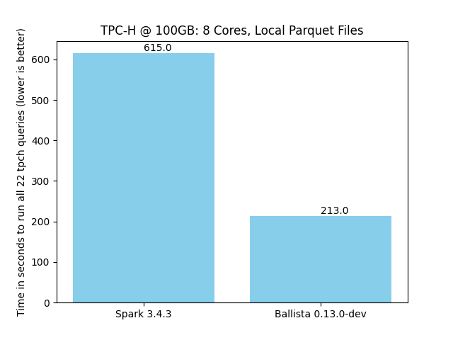
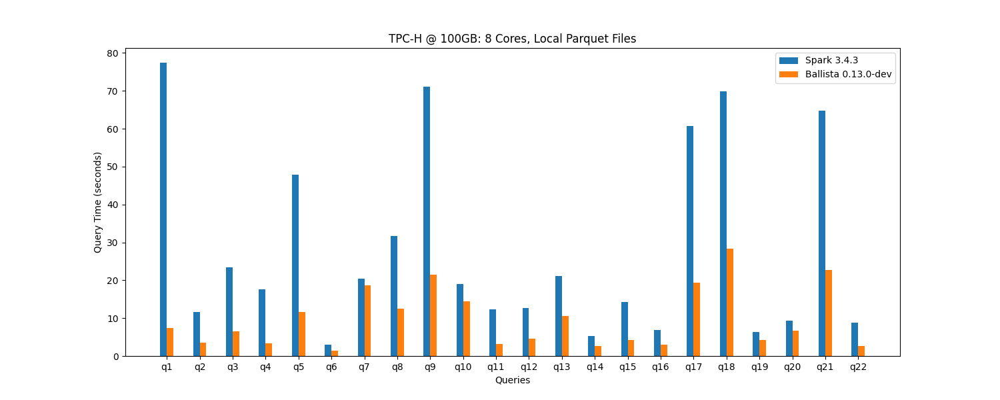
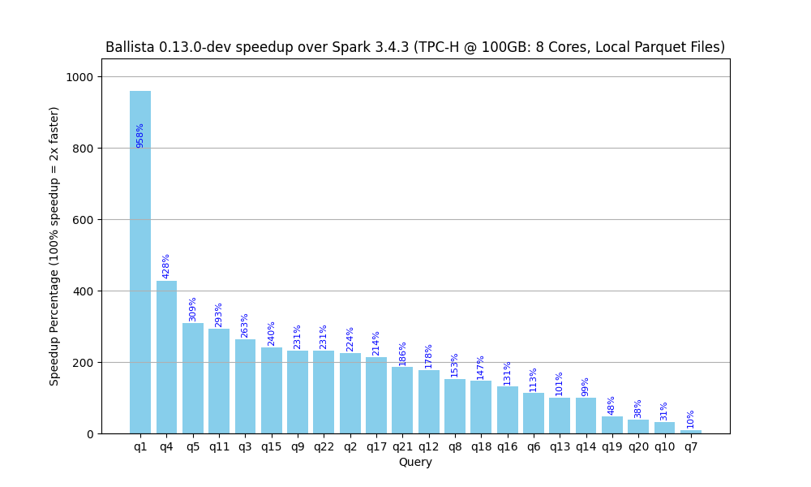
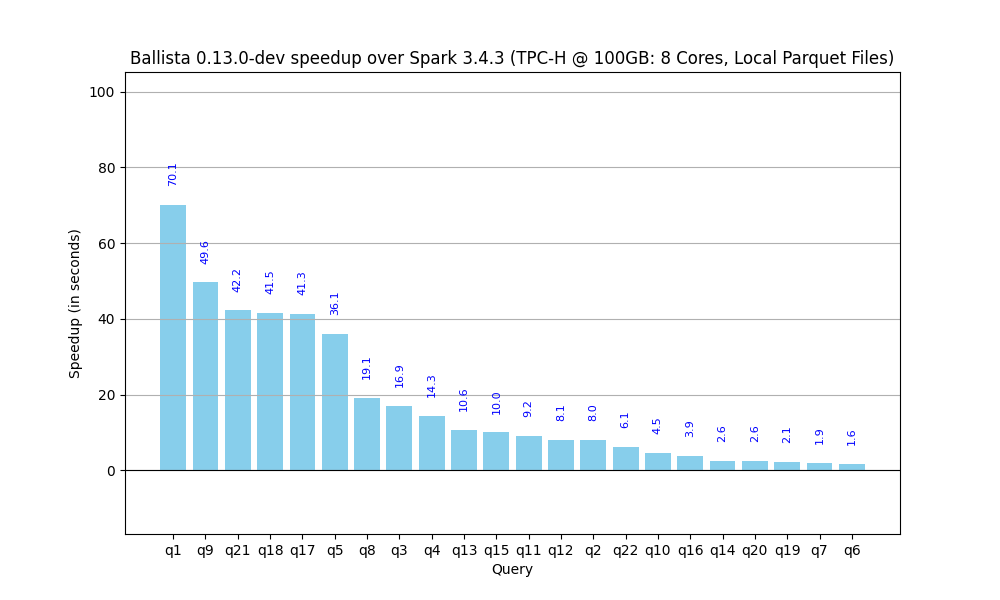

<!---
  Licensed to the Apache Software Foundation (ASF) under one
  or more contributor license agreements.  See the NOTICE file
  distributed with this work for additional information
  regarding copyright ownership.  The ASF licenses this file
  to you under the Apache License, Version 2.0 (the
  "License"); you may not use this file except in compliance
  with the License.  You may obtain a copy of the License at

    http://www.apache.org/licenses/LICENSE-2.0

  Unless required by applicable law or agreed to in writing,
  software distributed under the License is distributed on an
  "AS IS" BASIS, WITHOUT WARRANTIES OR CONDITIONS OF ANY
  KIND, either express or implied.  See the License for the
  specific language governing permissions and limitations
  under the License.
-->

# Ballista: Making DataFusion Applications Distributed

[![Apache licensed][license-badge]][license-url]

[license-badge]: https://img.shields.io/badge/license-Apache%20v2-blue.svg
[license-url]: https://github.com/apache/datafusion-comet/blob/main/LICENSE.txt


Ballista is a distributed query execution engine that enhances [Apache DataFusion](https://github.com/apache/datafusion) by enabling the parallelized execution of workloads across multiple nodes in a distributed environment.

Existing DataFusion application:

```rust
use datafusion::prelude::*;

#[tokio::main]
async fn main() -> datafusion::error::Result<()> {
  let ctx = SessionContext::new();

  // register the table
  ctx.register_csv("example", "tests/data/example.csv", CsvReadOptions::new())
      .await?;

  // create a plan to run a SQL query
  let df = ctx
      .sql("SELECT a, MIN(b) FROM example WHERE a <= b GROUP BY a LIMIT 100")
      .await?;

  // execute and print results
  df.show().await?;
  Ok(())
}
```

can be distributed with few lines of code changed:

> [!IMPORTANT]  
> There is a gap between DataFusion and Ballista, which may bring incompatibilities. The community is actively working to close the gap

```rust
use ballista::prelude::*;
use datafusion::prelude::*;

#[tokio::main]
async fn main() -> datafusion::error::Result<()> {
    // create SessionContext with ballista support
    // standalone context will start all required
    // ballista infrastructure in the background as well
    let ctx = SessionContext::standalone().await?;

    // everything else remains the same

    // register the table
    ctx.register_csv("example", "tests/data/example.csv", CsvReadOptions::new())
        .await?;

    // create a plan to run a SQL query
    let df = ctx
        .sql("SELECT a, MIN(b) FROM example WHERE a <= b GROUP BY a LIMIT 100")
        .await?;

    // execute and print results
    df.show().await?;
    Ok(())
}
```

For documentation or more examples, please refer to the [Ballista User Guide][user-guide].

## Architecture

A Ballista cluster consists of one or more scheduler processes and one or more executor processes. These processes
can be run as native binaries and are also available as Docker Images, which can be easily deployed with
[Docker Compose](https://datafusion.apache.org/ballista/user-guide/deployment/docker-compose.html) or
[Kubernetes](https://datafusion.apache.org/ballista/user-guide/deployment/kubernetes.html).

The following diagram shows the interaction between clients and the scheduler for submitting jobs, and the interaction
between the executor(s) and the scheduler for fetching tasks and reporting task status.


See the [architecture guide](docs/source/contributors-guide/architecture.md) for more details.

## Performance

We run some simple benchmarks comparing Ballista with Apache Spark to track progress with performance optimizations.
These are benchmarks derived from TPC-H and not official TPC-H benchmarks. These results are from running individual
queries at scale factor 100 (100 GB) on a single node with a single executor and 8 concurrent tasks.

### Overall Speedup

The overall speedup is 2.9x



### Per Query Comparison



### Relative Speedup



### Absolute Speedup



## Getting Started

The easiest way to get started is to run one of the standalone or distributed [examples](./examples/README.md). After
that, refer to the [Getting Started Guide](ballista/client/README.md).

## Cargo Features

Ballista uses Cargo features to enable optional functionality. Below are the available features for each crate.

### ballista (client)

| Feature      | Default | Description                                                    |
| ------------ | ------- | -------------------------------------------------------------- |
| `standalone` | Yes     | Enables standalone mode with in-process scheduler and executor |

### ballista-core

| Feature                   | Default | Description                                                            |
| ------------------------- | ------- | ---------------------------------------------------------------------- |
| `arrow-ipc-optimizations` | Yes     | Enables Arrow IPC optimizations for better shuffle performance         |
| `spark-compat`            | No      | Enables Spark compatibility mode via datafusion-spark                  |
| `build-binary`            | No      | Required for building binary executables (AWS S3 support, CLI parsing) |
| `force_hash_collisions`   | No      | Testing-only: forces all values to hash to same value                  |

### ballista-scheduler

| Feature                    | Default | Description                                      |
| -------------------------- | ------- | ------------------------------------------------ |
| `build-binary`             | Yes     | Builds the scheduler binary with CLI and logging |
| `substrait`                | Yes     | Enables Substrait plan support                   |
| `prometheus-metrics`       | No      | Enables Prometheus metrics collection            |
| `graphviz-support`         | No      | Enables execution graph visualization            |
| `spark-compat`             | No      | Enables Spark compatibility mode                 |
| `keda-scaler`              | No      | Kubernetes Event Driven Autoscaling integration  |
| `rest-api`                 | No      | Enables REST API endpoints                       |
| `disable-stage-plan-cache` | No      | Disables caching of stage execution plans        |

### ballista-executor

| Feature                   | Default | Description                                           |
| ------------------------- | ------- | ----------------------------------------------------- |
| `arrow-ipc-optimizations` | Yes     | Enables Arrow IPC optimizations                       |
| `build-binary`            | Yes     | Builds the executor binary with CLI and logging       |
| `mimalloc`                | Yes     | Uses mimalloc memory allocator for better performance |
| `spark-compat`            | No      | Enables Spark compatibility mode                      |

### Usage Examples

```bash
# Build with standalone support (default)
cargo build -p ballista

# Build with Substrait support
cargo build -p ballista-scheduler --features substrait

# Build with Spark compatibility
cargo build -p ballista-executor --features spark-compat
```

## Project Status

Ballista supports a wide range of SQL, including CTEs, Joins, and subqueries and can execute complex queries at scale,
but still there is a gap between DataFusion and Ballista which we want to bridge in near future.

Refer to the [DataFusion SQL Reference](https://datafusion.apache.org/user-guide/sql/index.html) for more
information on supported SQL.

## Contribution Guide

Please see the [Contribution Guide](CONTRIBUTING.md) for information about contributing to Ballista.

[user-guide]: https://datafusion.apache.org/ballista/
