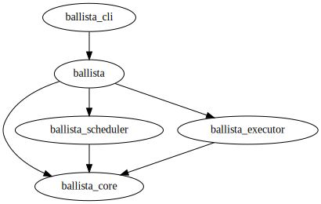

<!---
  Licensed to the Apache Software Foundation (ASF) under one
  or more contributor license agreements.  See the NOTICE file
  distributed with this work for additional information
  regarding copyright ownership.  The ASF licenses this file
  to you under the Apache License, Version 2.0 (the
  "License"); you may not use this file except in compliance
  with the License.  You may obtain a copy of the License at

    http://www.apache.org/licenses/LICENSE-2.0

  Unless required by applicable law or agreed to in writing,
  software distributed under the License is distributed on an
  "AS IS" BASIS, WITHOUT WARRANTIES OR CONDITIONS OF ANY
  KIND, either express or implied.  See the License for the
  specific language governing permissions and limitations
  under the License.
-->

# Release Process

## Branching

### Major Release

Ballista typically has major releases from the `master` branch every 1-3 months, including breaking API changes.

## Prerequisite

- Have upstream git repo `git@github.com:apache/arrow-ballista.git` add as git remote `apache`.
- Created a peronal access token in Github for changelog automation script.
  - Github PAT should be created with `repo` access
- Make sure your signing key is added to the following files in SVN:
  - https://dist.apache.org/repos/dist/dev/arrow/KEYS
  - https://dist.apache.org/repos/dist/release/arrow/KEYS

### How to add signing key

See instructions at https://infra.apache.org/release-signing.html#generate for generating keys.

Committers can add signing keys in Subversion client with their ASF account. e.g.:

```bash
$ svn co https://dist.apache.org/repos/dist/dev/arrow
$ cd arrow
$ editor KEYS
$ svn ci KEYS
```

Follow the instructions in the header of the KEYS file to append your key. Here is an example:

```bash
(gpg --list-sigs "John Doe" && gpg --armor --export "John Doe") >> KEYS
svn commit KEYS -m "Add key for John Doe"
```

## Process Overview

As part of the Apache governance model, official releases consist of signed
source tarballs approved by the PMC.

We then use the code in the approved artifacts to release to crates.io and
PyPI.

### Change Log

We maintain `CHANGELOG.md` for each sub project so our users know what has been
changed between releases.

The CHANGELOG is managed automatically using
[update_change_log.sh](https://github.com/apache/arrow-ballista/blob/master/dev/release/update_change_log.sh)

This script creates a changelog using github PRs and issues based on the labels
associated with them.

## Prepare release commits and PR

Prepare a PR to update `CHANGELOG.md` and versions to reflect the planned
release.

See [#801](https://github.com/apache/arrow-ballista/pull/801) for an example.

Here are the commands that could be used to prepare the `0.8.0` release:

### Update Version

Checkout the master commit to be released

```
git fetch apache
git checkout apache/master
```

Update version in `ballista/Cargo.toml` to `0.8.0`:

```
./dev/update_ballista_versions.py 0.8.0
```

Lastly commit the version change:

```
git commit -a -m 'Update version'
```

### Update CHANGELOG.md

Define release branch (e.g. `master`), base version tag (e.g. `0.8.0`) and future version tag (e.g. `0.9.0`). Commits
between the base version tag and the release branch will be used to populate the changelog content.

You will need a GitHub Personal Access Token for the following steps. Follow
[these instructions](https://docs.github.com/en/authentication/keeping-your-account-and-data-secure/creating-a-personal-access-token)
to generate one if you do not already have one.

```bash
# create the changelog
CHANGELOG_GITHUB_TOKEN=<TOKEN> ./dev/release/update_change_log-ballista.sh master 0.8.0 0.7.0
# review change log / edit issues and labels if needed, rerun until you are happy with the result
git commit -a -m 'Create changelog for release'
```

_If you see the error `"You have exceeded a secondary rate limit"` when running this script, try reducing the CPU
allocation to slow the process down and throttle the number of GitHub requests made per minute, by modifying the
value of the `--cpus` argument in the `update_change_log.sh` script._

You can add `invalid` or `development-process` label to exclude items from
release notes. Add `datafusion`, `ballista` and `python` labels to group items
into each sub-project's change log.

Send a PR to get these changes merged into `master` branch. If new commits that
could change the change log content landed in the `master` branch before you
could merge the PR, you need to rerun the changelog update script to regenerate
the changelog and update the PR accordingly.

## Prepare release candidate artifacts

After the PR gets merged, you are ready to create release artifacts based off the
merged commit.

(Note you need to be a committer to run these scripts as they upload to the apache svn distribution servers)

### Pick a Release Candidate (RC) number

Pick numbers in sequential order, with `0` for `rc0`, `1` for `rc1`, etc.

### Create git tag for the release:

While the official release artifacts are signed tarballs and zip files, we also
tag the commit it was created for convenience and code archaeology.

Using a string such as `0.8.0` as the `<version>`, create and push the tag by running these commands:

```shell
git fetch apache
git tag <version>-<rc> apache/master
# push tag to Github remote
git push apache <version>
```

### Create, sign, and upload artifacts

Run `create-tarball.sh` with the `<version>` tag and `<rc>` and you found in previous steps:

```shell
GH_TOKEN=<TOKEN> ./dev/release/create-tarball.sh 0.8.0 0
```

The `create-tarball.sh` script

1. creates and uploads all release candidate artifacts to the [arrow
   dev](https://dist.apache.org/repos/dist/dev/arrow) location on the
   apache distribution svn server

2. provide you an email template to
   send to dev@arrow.apache.org for release voting.

### Vote on Release Candidate artifacts

Send the email output from the script to dev@arrow.apache.org. The email should look like

```
To: dev@arrow.apache.org
Subject: [VOTE][Ballista] Release Apache Arrow Ballista 0.8.0 RC0

Hi,

I would like to propose a release of Apache Arrow Ballista Implementation,
version 0.8.0.

This release candidate is based on commit: a5dd428f57e62db20a945e8b1895de91405958c4 [1]
The proposed release artifacts and signatures are hosted at [2].
The changelog is located at [3].

Please download, verify checksums and signatures, run the unit tests,
and vote on the release.

The vote will be open for at least 72 hours.

[ ] +1 Release this as Apache Arrow Ballista 0.8.0
[ ] +0
[ ] -1 Do not release this as Apache Arrow Ballista 0.8.0 because...

[1]: https://github.com/apache/arrow-ballista/tree/a5dd428f57e62db20a945e8b1895de91405958c4
[2]: https://dist.apache.org/repos/dist/dev/arrow/apache-arrow-ballista-0.8.0
[3]: https://github.com/apache/arrow-ballista/blob/a5dd428f57e62db20a945e8b1895de91405958c4/CHANGELOG.md
```

For the release to become "official" it needs at least three PMC members to vote +1 on it.

### Verifying Release Candidates

The `dev/release/verify-release-candidate.sh` is a script in this repository that can assist in the verification process. Run it like:

```
./dev/release/verify-release-candidate.sh 0.8.0 0
```

#### If the release is not approved

If the release is not approved, fix whatever the problem is, merge changelog
changes into master if there is any and try again with the next RC number.

## Finalize the release

NOTE: steps in this section can only be done by PMC members.

### After the release is approved

Move artifacts to the release location in SVN, e.g.
https://dist.apache.org/repos/dist/release/arrow/arrow-ballista-0.8.0/, using
the `release-tarball.sh` script:

```shell
./dev/release/release-tarball.sh 0.8.0 0
```

Congratulations! The release is now official!

### Create release git tags

Tag the same release candidate commit with the final release tag

```
git co apache 0.8.0-rc1
git tag 0.8.0
git push apache 0.8.0
```

### Publish on Crates.io

Only approved releases of the tarball should be published to
crates.io, in order to conform to Apache Software Foundation
governance standards.

An Arrow committer can publish this crate after an official project release has
been made to crates.io using the following instructions.

Follow [these
instructions](https://doc.rust-lang.org/cargo/reference/publishing.html) to
create an account and login to crates.io before asking to be added as an owner
of the following crates:

- [ballista](https://crates.io/crates/ballista)
- [ballista-cli](https://crates.io/crates/ballista-cli)
- [ballista-core](https://crates.io/crates/ballista-core)
- [ballista-executor](https://crates.io/crates/ballista-executor)
- [ballista-scheduler](https://crates.io/crates/ballista-scheduler)

Download and unpack the official release tarball

Verify that the Cargo.toml in the tarball contains the correct version
(e.g. `version = "0.8.0"`) and then publish the crates with the
following commands. Crates need to be published in the correct order as shown in this diagram.



_To update this diagram, manually edit the dependencies in [crate-deps.dot](crate-deps.dot) and then run:_

```bash
dot -Tsvg dev/release/crate-deps.dot > dev/release/crate-deps.svg
```

```shell
(cd ballista/core && cargo publish)
(cd ballista/executor && cargo publish)
(cd ballista/scheduler && cargo publish)
(cd ballista/client && cargo publish)
(cd ballista-cli && cargo publish)
```

### Publish Docker Images

We do not yet publish Docker images to the official Apache DockerHub account but there is an issue open for this
([#236](https://github.com/apache/arrow-ballista/issues/236)).

To build Docker images:

```shell
BALLISTA_VERSION=0.8.0 ./dev/build-ballista-docker.sh
```

Note that it is not currently possible to build the Docker images on Apple silicon. Tracking issue is
[#17](https://github.com/apache/arrow-ballista/issues/17).

The Docker image is tagged as `apache/arrow-ballista:0.8.0`.

### Call the vote

Call the vote on the Arrow dev list by replying to the RC voting thread. The
reply should have a new subject constructed by adding `[RESULT]` prefix to the
old subject line.

Sample announcement template:

```
The vote has passed with <NUMBER> +1 votes. Thank you to all who helped
with the release verification.
```

### Delete old RCs and Releases

See the ASF documentation on [when to archive](https://www.apache.org/legal/release-policy.html#when-to-archive)
for more information.

#### Deleting old release candidates from `dev` svn

Release candidates should be deleted once the release is published.

Get a list of Ballista release candidates:

```bash
svn ls https://dist.apache.org/repos/dist/dev/arrow | grep ballista
```

Delete a release candidate:

```bash
svn delete -m "delete old Ballista RC" https://dist.apache.org/repos/dist/dev/arrow/apache-arrow-ballista-0.8.0-rc1/
```

#### Deleting old releases from `release` svn

Only the latest release should be available. Delete old releases after publishing the new release.

Get a list of Ballista releases:

```bash
svn ls https://dist.apache.org/repos/dist/release/arrow | grep ballista
```

Delete a release:

```bash
svn delete -m "delete old Ballista release" https://dist.apache.org/repos/dist/release/arrow/arrow-ballista-0.8.0
```
