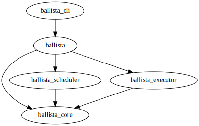

<!---
  Licensed to the Apache Software Foundation (ASF) under one
  or more contributor license agreements.  See the NOTICE file
  distributed with this work for additional information
  regarding copyright ownership.  The ASF licenses this file
  to you under the Apache License, Version 2.0 (the
  "License"); you may not use this file except in compliance
  with the License.  You may obtain a copy of the License at

    http://www.apache.org/licenses/LICENSE-2.0

  Unless required by applicable law or agreed to in writing,
  software distributed under the License is distributed on an
  "AS IS" BASIS, WITHOUT WARRANTIES OR CONDITIONS OF ANY
  KIND, either express or implied.  See the License for the
  specific language governing permissions and limitations
  under the License.
-->

# Release Process

Development happens on the `main` branch, and most of the time, we depend on DataFusion using a git dependency (depending
on a specific git revision) rather than using an official release from crates.io. This allows us to pick up new
features and bug fixes frequently by creating PRs to move to a later revision of the code. It also means we can
incrementally make updates that are required due to changes in DataFusion rather than having a large amount of work
to do when the next official release is available.

When there is a new official release of DataFusion, we update the `main` branch to point to that, update the version
number, and create a new release branch, such as `branch-0.11`. Once this branch is created, we switch the `main` branch
back to using GitHub dependencies. The release activity (such as generating the changelog) can then happen on the
release branch without blocking ongoing development in the `main` branch.

We can cherry-pick commits from the `main` branch into `branch-0.11` as needed and then create new patch releases
from that branch.

## Who Can Create Releases?

Although some tasks can only be performed by a PMC member, many tasks can be performed by committers and contributors.

### Release Preparation

| Task                                                             | Role Required |
| ---------------------------------------------------------------- | ------------- |
| Create PRs against main branch to update DataFusion dependencies | None          |
| Create PRs against main branch to update Ballista version        | None          |
| Create release branch (e.g. branch-0.11)                         | Committer     |
| Create PRs against release branch with CHANGELOG                 | None          |
| Create PRs against release branch with cherry-picked commits     | None          |
| Create release candidate tag                                     | Committer     |

### Release

| Task                                                | Role Required |
| --------------------------------------------------- | ------------- |
| Create release candidate tarball and publish to SVN | PMC           |
| Start vote on mailing list                          | PMC           |
| Call vote on mailing list                           | PMC           |
| Publish release tarball to SVN                      | PMC           |
| Publish binary artifacts to crates.io               | PMC           |

### Post-Release

| Task                                                         | Role Required |
|--------------------------------------------------------------| ------------- |
| Create PR against datafusion-site with updated documentation | None          |
| Publish Python wheels to PyPI                                | PMC           |

## Detailed Guide

### Prerequisite

- You will need a GitHub Personal Access Token with "repo" access. Follow
  [these instructions](https://docs.github.com/en/authentication/keeping-your-account-and-data-secure/creating-a-personal-access-token)
  to generate one if you do not already have one.
- Have upstream git repo `git@github.com:apache/datafusion-ballista.git` add as git remote `apache`.

### Preparing the `main` Branch

Before creating a new release:

- We need to ensure that the main branch does not have any GitHub dependencies
- a PR should be created and merged to update the major version number of the project. There is a script to automate
  updating the version number: `./dev/update_ballista_versions.py 0.11.0`
- A new release branch should be created, such as `branch-0.11`

Once the release branch has been created, the `main` branch can immediately go back to depending on DataFusion with a
GitHub dependency.

### Change Log

We maintain per-release changelogs under
[`docs/source/changelog/`](../../docs/source/changelog/). They are surfaced
in the Sphinx site through `docs/source/changelog/index.md`.

You will need a GitHub Personal Access Token for the following steps.
Follow
[these instructions](https://docs.github.com/en/authentication/keeping-your-account-and-data-secure/creating-a-personal-access-token)
to generate one if you do not already have one. The changelog script
depends on `PyGitHub`:

```bash
pip3 install PyGitHub
```

Run the generator from the repo root, pointing at the previous release
tag and the new release tag (or `HEAD`):

```bash
GITHUB_TOKEN=<TOKEN> ./dev/release/generate-changelog.py \
    52.0.0 HEAD 53.0.0 \
    > docs/source/changelog/53.0.0.md
```

The script writes a fully-formed file: ASF header, version title, commit /
contributor summary, categorized PR list, and a Credits section. The only
remaining manual step is to prepend the new version to the toctree at the
top of `docs/source/changelog/index.md`:

````
```{toctree}
:maxdepth: 1

53.0.0
52.0.0
...
```
````

Send a PR with the new file and the updated index to the release branch
(e.g. `branch-53`). If new commits land in the release branch before
merge, rerun the generator to refresh the file.

## Prepare release candidate artifacts

After the PR gets merged, you are ready to create release artifacts based off the
merged commit.

(Note you need to be a committer to run these scripts as they upload to the apache svn distribution servers)

### Pick a Release Candidate (RC) number

Pick numbers in sequential order, with `0` for `rc0`, `1` for `rc1`, etc.

### Create git tag for the release:

While the official release artifacts are signed tarballs and zip files, we also
tag the commit it was created for convenience and code archaeology.

Using a string such as `0.11.0` as the `<version>`, create and push the tag by running these commands:

```shell
git tag <version>-<rc>
# push tag to Github remote
git push apache <version>
```

### Create, sign, and upload artifacts

- Make sure your signing key is added to the following files in SVN:
    - https://dist.apache.org/repos/dist/dev/datafusion/KEYS
    - https://dist.apache.org/repos/dist/release/datafusion/KEYS

See instructions at https://infra.apache.org/release-signing.html#generate for generating keys.

Committers can add signing keys in Subversion client with their ASF account. e.g.:

```bash
$ svn co https://dist.apache.org/repos/dist/dev/datafusion
$ cd datafusion
$ editor KEYS
$ svn ci KEYS
```

Follow the instructions in the header of the KEYS file to append your key. Here is an example:

```bash
(gpg --list-sigs "John Doe" && gpg --armor --export "John Doe") >> KEYS
svn commit KEYS -m "Add key for John Doe"
```

Run `create-tarball.sh` with the `<version>` tag and `<rc>` and you found in previous steps:

```shell
./dev/release/create-tarball.sh 0.11.0 1
```

The `create-tarball.sh` script

1. creates and uploads all release candidate artifacts to the [datafusion
   dev](https://dist.apache.org/repos/dist/dev/datafusion) location on the
   apache distribution svn server

2. provide you an email template to
   send to dev@datafusion.apache.org for release voting.

### Vote on Release Candidate artifacts

Send the email output from the script to dev@datafusion.apache.org. 


For the release to become "official" it needs at least three PMC members to vote +1 on it.

### Verifying Release Candidates

The `dev/release/verify-release-candidate.sh` is a script in this repository that can assist in the verification process. It downloads the source tarball from the ASF dev SVN, verifies the GPG signature and checksums, and builds the Rust workspace. Run it like:

```
./dev/release/verify-release-candidate.sh 0.11.0 0
```

#### (Optional) Verify the Python wheels from TestPyPI

If the release manager has uploaded the RC's Python wheels to
[test.pypi.org](https://test.pypi.org/project/ballista/) as part of their
pre-vote dry-run (see [Publish Python Wheels to PyPI](#publish-python-wheels-to-pypi)
below), verifiers can install them in a throwaway virtualenv to sanity-check
the artifacts that will ship to real PyPI. The wheels there are byte-identical
to what would be uploaded to pypi.org if the vote passes.

The wheels are built as `cp310-abi3`, so the venv needs Python ≥ 3.10:

```bash
export BALLISTA_VERSION=53.0.0    # version under vote

python3.10 -m venv /tmp/ballista-rc-verify
source /tmp/ballista-rc-verify/bin/activate
pip install -i https://test.pypi.org/simple/ \
    --extra-index-url https://pypi.org/simple/ \
    ballista==${BALLISTA_VERSION}
python -c "from ballista import BallistaSessionContext; print('ok')"
deactivate
```

`--extra-index-url` is required because TestPyPI does not mirror dependencies
like `pyarrow` and `datafusion`.

If no version of `ballista==${BALLISTA_VERSION}` is yet on TestPyPI, the
release manager has not (yet) uploaded the dry-run — that step is
optional and not a blocker for voting.

#### If the release is not approved

If the release is not approved, fix whatever the problem is, merge changelog
changes into main if there is any and try again with the next RC number.

## Finalize the release

NOTE: steps in this section can only be done by PMC members.

### After the release is approved

Move artifacts to the release location in SVN, e.g.
https://dist.apache.org/repos/dist/release/datafusion/datafusion-ballista-0.8.0/, using
the `release-tarball.sh` script:

```shell
./dev/release/release-tarball.sh 0.11.0 1
```

Congratulations! The release is now official!

### Create release git tags

Tag the same release candidate commit with the final release tag

```
git checkout 0.11.0-rc1
git tag 0.11.0
git push apache 0.11.0
```

### Publish on Crates.io

Only approved releases of the tarball should be published to
crates.io, in order to conform to Apache Software Foundation
governance standards.

A DataFusion committer can publish this crate after an official project release has
been made to crates.io using the following instructions.

Follow [these
instructions](https://doc.rust-lang.org/cargo/reference/publishing.html) to
create an account and login to crates.io before asking to be added as an owner
of the following crates:

- [ballista](https://crates.io/crates/ballista)
- [ballista-cli](https://crates.io/crates/ballista-cli)
- [ballista-core](https://crates.io/crates/ballista-core)
- [ballista-executor](https://crates.io/crates/ballista-executor)
- [ballista-scheduler](https://crates.io/crates/ballista-scheduler)

Download and unpack the official release tarball

Verify that the Cargo.toml in the tarball contains the correct version
(e.g. `version = "0.8.0"`) and then publish the crates with the
following commands. Crates need to be published in the correct order as shown in this diagram.



_To update this diagram, manually edit the dependencies in [crate-deps.dot](crate-deps.dot) and then run:_

```bash
dot -Tsvg dev/release/crate-deps.dot > dev/release/crate-deps.svg
```

```shell
(cd ballista/core && cargo publish)
(cd ballista/executor && cargo publish)
(cd ballista/scheduler && cargo publish)
(cd ballista/client && cargo publish)
(cd ballista-cli && cargo publish)
```

### Publish Python Wheels to PyPI

Only approved releases of the tarball should be published to PyPI, in order to
conform to Apache Software Foundation governance standards. The Python wheels
that get uploaded must be the same artifacts that the community voted on — they
are downloaded from the release candidate's CI run, not rebuilt.

#### Prerequisites

A DataFusion PMC member can publish the [`ballista` package on
PyPI](https://pypi.org/project/ballista/) after an official project release has
been made. One-time setup:

- Create accounts on [pypi.org](https://pypi.org) and
  [test.pypi.org](https://test.pypi.org) (separate accounts).
- Ask an existing maintainer of the `ballista` PyPI project — listed on the
  project page — to add you as a maintainer. The request should be made on the
  dev mailing list so it is publicly tracked.
- Generate project-scoped API tokens for both PyPI and TestPyPI.
- Configure `~/.pypirc`:

  ```ini
  [distutils]
  index-servers =
      pypi
      testpypi

  [pypi]
  username = __token__
  password = pypi-...

  [testpypi]
  repository = https://test.pypi.org/legacy/
  username = __token__
  password = pypi-...
  ```

- Restrict the permissions on `~/.pypirc` so the API tokens are not world-readable:

  ```bash
  chmod 600 ~/.pypirc
  ```

- Install `twine` and `requests` (the latter is used by
  `dev/release/download-python-wheels.py`):

  ```bash
  pip install twine requests
  ```

#### Download the Voted-On Wheels

Once the vote passes and the final tag has been created from the RC commit,
download the same wheels that were voted on from the RC's CI run. Retagging the
RC commit does not trigger a fresh build, so the RC artifacts remain the
canonical source.

> **Artifact retention warning:** GitHub Actions artifacts default to 90-day
> retention. If the elapsed time from cutting the RC to publishing PyPI wheels
> exceeds that window, the wheels will have been deleted and are unrecoverable
> — you cannot publish the voted-on artifacts and must cut a new RC and revote.
> Plan the vote and the post-vote publish so the publish step happens
> comfortably inside the 90-day window. Check the run's `expires_at` on
> `https://github.com/apache/datafusion-ballista/actions` if in doubt.

Export the release version and RC number so the rest of this section can be
copy-pasted without manual edits:

```bash
export BALLISTA_VERSION=53.0.0       # PEP 440 release version; matches the wheels
export BALLISTA_RC_NUM=1              # which RC tag CI built the wheels from
export GH_TOKEN=...                   # GitHub PAT with read access to actions
```

```bash
mkdir ballista-pypi-${BALLISTA_VERSION}-rc${BALLISTA_RC_NUM}
cd ballista-pypi-${BALLISTA_VERSION}-rc${BALLISTA_RC_NUM}
python ../dev/release/download-python-wheels.py ${BALLISTA_VERSION}-rc${BALLISTA_RC_NUM}
ls *.whl *.tar.gz       # confirm filenames carry the right version
```

> **GPG signing needs an interactive terminal.** The script signs each
> artifact with `gpg --detach-sig`, which prompts for the key passphrase. From
> a non-interactive shell the prompt fails with `gpg: signing failed:
> Inappropriate ioctl for device` and the script aborts after the first
> artifact. Either run from an interactive shell, or configure `gpg-agent`
> with `pinentry-mode loopback` and a cached passphrase. The wheels and sdist
> are downloaded before the signing step, so for a TestPyPI-only dry-run the
> traceback is harmless (PyPI does not accept `.asc` files anyway).

The merged artifact should contain one of each of the following platform wheels
(file naming uses [PEP 425](https://peps.python.org/pep-0425/) tags; the
`manylinux_X_Y` glibc tag depends on the Linux runner image and changes over
time, so glob it rather than pinning a specific value):

- `ballista-${BALLISTA_VERSION}-cp310-abi3-manylinux_*_x86_64.whl`
- `ballista-${BALLISTA_VERSION}-cp310-abi3-manylinux_*_aarch64.whl`
- `ballista-${BALLISTA_VERSION}-cp310-abi3-macosx_*_arm64.whl`
- `ballista-${BALLISTA_VERSION}-cp310-abi3-win_amd64.whl`
- `ballista-${BALLISTA_VERSION}.tar.gz` (sdist)

> **Verify every expected file is present.** The `merge-build-artifacts` job
> in `.github/workflows/build.yml` has been observed to silently drop wheels
> when merging the per-platform artifacts. If any wheel from the list above is
> missing from the merged `dist` artifact, fall back to downloading the
> individual per-platform artifacts directly from the workflow run:
>
> ```bash
> gh run download <run-id> --repo apache/datafusion-ballista \
>   --name dist-manylinux-aarch64 \
>   --name dist-manylinux-x86_64 \
>   --name dist-macos-latest \
>   --name dist-windows-2022 \
>   --name dist-sdist
> ```
>
> Then re-sign each downloaded file with `gpg --detach-sig` and regenerate the
> `.sha256` / `.sha512` checksums the same way `download-python-wheels.py`
> does. Do **not** proceed to upload an incomplete platform set.
>
> If only the sdist is missing, it can also be rebuilt locally from the RC
> tag (the `build-sdist` job uploads it as `dist-sdist` so this should not
> normally be needed):
>
> ```bash
> git checkout ${BALLISTA_VERSION}-rc${BALLISTA_RC_NUM}
> cd python
> uv run --no-project maturin sdist --out dist
> ```

#### Validate the Artifacts

```bash
twine check *.whl *.tar.gz
```

The `download-python-wheels.py` script also writes `.asc` GPG signatures and
`.sha256` / `.sha512` checksum files alongside each artifact. Those are for ASF
SVN — PyPI rejects them. Pass explicit globs to `twine` so only the wheels and
sdist are considered.

#### TestPyPI Dry-Run

PyPI uploads are immutable: once a version is published it cannot be replaced
or re-uploaded, only yanked. A TestPyPI dry-run takes a few minutes and catches
the common ways a release goes wrong.

```bash
twine upload --repository testpypi *.whl *.tar.gz

# Wheels are cp310-abi3 so the venv needs Python >= 3.10. Using `python -m venv`
# with macOS's stock /usr/bin/python3 (3.9) silently picks no wheel and pip
# reports a misleading "No matching distribution found".
python3.10 -m venv /tmp/ballista-pypi-smoke
source /tmp/ballista-pypi-smoke/bin/activate
pip install -i https://test.pypi.org/simple/ \
    --extra-index-url https://pypi.org/simple/ \
    ballista==${BALLISTA_VERSION}
python -c "from ballista import BallistaSessionContext; print('ok')"
deactivate
```

`--extra-index-url` is required because TestPyPI does not mirror dependencies
like `pyarrow` and `datafusion`.

#### Upload to PyPI

```bash
twine upload *.whl *.tar.gz
```

If the upload fails partway through, re-run with `--skip-existing` to retry only
the files that did not get through.

#### Verify

Confirm the new version appears at
`https://pypi.org/project/ballista/${BALLISTA_VERSION}/`. Then in another fresh
virtual environment:

```bash
python -m venv /tmp/ballista-pypi-verify
source /tmp/ballista-pypi-verify/bin/activate
pip install ballista==${BALLISTA_VERSION}
python -c "from ballista import BallistaSessionContext; print('ok')"
deactivate
```

#### Recovery

**`twine check` fails.** The artifacts shipped from CI are malformed (bad
metadata, missing `LICENSE.txt`, etc.). Do not proceed. Open an issue, fix in
`python/pyproject.toml` or the `generate-license` job, cut a new RC, re-vote.
Do not hand-edit wheels.

**TestPyPI smoke install or import fails.** Same recovery — the wheels are
broken; cut a new RC. The TestPyPI version stays published forever; you can
yank it with `twine yank --repository testpypi ballista ${BALLISTA_VERSION}`
so it does not resolve, but the filename is permanently consumed on TestPyPI.

**PyPI upload fails partway.** Some wheels uploaded, others did not. Re-run
with `--skip-existing`:

```bash
twine upload --skip-existing *.whl *.tar.gz
```

If a *broken* file actually made it to PyPI, it cannot be replaced.
`twine yank ballista ${BALLISTA_VERSION}` removes the version from
`pip install ballista` resolution, but the version number is permanently
consumed. Recovery requires bumping to `${BALLISTA_VERSION}.post1` and
starting over from "Download the Voted-On Wheels" — which in turn requires
cutting a new RC, since post-releases must also be voted on.

### Publish Docker Images

Pushing a release tag causes Docker images to be published.

Images can be found at [https://github.com/apache/datafusion-ballista/pkgs/container/datafusion-ballista-standalone](https://github.com/apache/datafusion-ballista/pkgs/container/datafusion-ballista-standalone)

### Call the vote

Call the vote on the DataFusion dev list by replying to the RC voting thread. The
reply should have a new subject constructed by adding `[RESULT]` prefix to the
old subject line.

Sample announcement template:

```
The vote has passed with <NUMBER> +1 votes. Thank you to all who helped
with the release verification.
```

### Add the release to Apache Reporter

Add the release to https://reporter.apache.org/addrelease.html?datafusion with a version name prefixed with `BALLISTA-`,
for example `BALLISTA-0.9.0`.

The release information is used to generate a template for a board report (see example
[here](https://github.com/apache/arrow/pull/14357)).

### Delete old RCs and Releases

See the ASF documentation on [when to archive](https://www.apache.org/legal/release-policy.html#when-to-archive)
for more information.

#### Deleting old release candidates from `dev` svn

Release candidates should be deleted once the release is published.

Get a list of Ballista release candidates:

```bash
svn ls https://dist.apache.org/repos/dist/dev/datafusion | grep ballista
```

Delete a release candidate:

```bash
svn delete -m "delete old Ballista RC" https://dist.apache.org/repos/dist/dev/datafusion/apache-datafusion-ballista-0.8.0-rc1/
```

#### Deleting old releases from `release` svn

Only the latest release should be available. Delete old releases after publishing the new release.

Get a list of Ballista releases:

```bash
svn ls https://dist.apache.org/repos/dist/release/datafusion | grep ballista
```

Delete a release:

```bash
svn delete -m "delete old Ballista release" https://dist.apache.org/repos/dist/release/datafusion/datafusion-ballista-0.8.0
```

### Optional: Write a blog post announcing the release

We typically crowdsource release announcements by collaborating on a Google document, usually starting
with a copy of the previous release announcement.

Run the following commands to get the number of commits and number of unique contributors for inclusion in the blog post.

```bash
git log --pretty=oneline 0.11.0..0.10.0 ballista ballista-cli examples | wc -l
git shortlog -sn 0.11.0..0.10.0 ballista ballista-cli examples | wc -l
```

Once there is consensus on the contents of the post, create a PR to add a blog post to the
[datafusion-site](https://github.com/apache/datafusion-site) repository. Note that there is no need for a formal
PMC vote on the blog post contents since this isn't considered to be a "release".

Once the PR is merged, a GitHub action will publish the new blog post to https://datafusion.apache.org/blog/.
