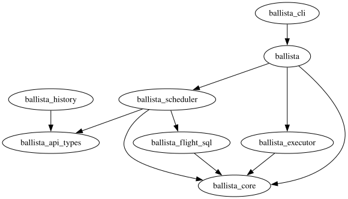

<!---
  Licensed to the Apache Software Foundation (ASF) under one
  or more contributor license agreements.  See the NOTICE file
  distributed with this work for additional information
  regarding copyright ownership.  The ASF licenses this file
  to you under the Apache License, Version 2.0 (the
  "License"); you may not use this file except in compliance
  with the License.  You may obtain a copy of the License at

    http://www.apache.org/licenses/LICENSE-2.0

  Unless required by applicable law or agreed to in writing,
  software distributed under the License is distributed on an
  "AS IS" BASIS, WITHOUT WARRANTIES OR CONDITIONS OF ANY
  KIND, either express or implied.  See the License for the
  specific language governing permissions and limitations
  under the License.
-->

# Release Process

Development happens on the `main` branch, and most of the time, we depend on DataFusion using a git dependency (depending
on a specific git revision) rather than using an official release from crates.io. This allows us to pick up new
features and bug fixes frequently by creating PRs to move to a later revision of the code. It also means we can
incrementally make updates that are required due to changes in DataFusion rather than having a large amount of work
to do when the next official release is available.

When there is a new official release of DataFusion, we update the `main` branch to point to that, update the version
number, and create a new release branch, such as `branch-0.11`. Once this branch is created, we switch the `main` branch
back to using GitHub dependencies. The release activity (such as generating the changelog) can then happen on the
release branch without blocking ongoing development in the `main` branch.

We can cherry-pick commits from the `main` branch into `branch-0.11` as needed and then create new patch releases
from that branch.

This document covers the release of the Rust crates. The Python client in `python/` depends on
[datafusion-python](https://github.com/apache/datafusion-python), which usually publishes a new major version some
weeks after DataFusion does, so it is released separately, with its own release candidate and vote, from the same
release branch. See [python/dev/release/README.md](../../python/dev/release/README.md) for that process.

## Who Can Create Releases?

Although some tasks can only be performed by a PMC member, many tasks can be performed by committers and contributors.

### Release Preparation

| Task                                                             | Role Required |
| ---------------------------------------------------------------- | ------------- |
| Create PRs against main branch to update DataFusion dependencies | None          |
| Create PRs against main branch to update Ballista version        | None          |
| Create release branch (e.g. branch-0.11)                         | Committer     |
| Create PRs against release branch with CHANGELOG                 | None          |
| Create PRs against release branch with cherry-picked commits     | None          |
| Create release candidate tag                                     | Committer     |

### Release

| Task                                                | Role Required |
| --------------------------------------------------- | ------------- |
| Create release candidate tarball and publish to SVN | PMC           |
| Start vote on mailing list                          | PMC           |
| Call vote on mailing list                           | PMC           |
| Publish release tarball to SVN                      | PMC           |
| Publish binary artifacts to crates.io               | PMC           |

### Post-Release

| Task                                                                                     | Role Required |
| ---------------------------------------------------------------------------------------- | ------------- |
| Create PR against datafusion-site with updated documentation                             | None          |
| Release the Python client, see [its release process](../../python/dev/release/README.md) | PMC           |

## Detailed Guide

### Prerequisite

- You will need a GitHub Personal Access Token with "repo" access. Follow
  [these instructions](https://docs.github.com/en/authentication/keeping-your-account-and-data-secure/creating-a-personal-access-token)
  to generate one if you do not already have one.
- Have upstream git repo `git@github.com:apache/datafusion-ballista.git` add as git remote `apache`.

### Preparing the `main` Branch

Before creating a new release:

- We need to ensure that the main branch does not have any GitHub dependencies
- a PR should be created and merged to update the major version number of the project. There is a script to automate
  updating the version number: `./dev/update_ballista_versions.py 0.11.0`. The script does not change `python/`,
  which is versioned as part of the [Python client release](../../python/dev/release/README.md)
- Add the new release branch to `github.protected_branches` in `.asf.yaml` so that it requires an approving review
- A new release branch should be created, such as `branch-0.11`

Once the release branch has been created, the `main` branch can immediately go back to depending on DataFusion with a
GitHub dependency.

### Change Log

We maintain per-release changelogs under
[`docs/source/changelog/`](../../docs/source/changelog/). They are surfaced
in the Sphinx site through `docs/source/changelog/index.md`.

You will need a GitHub Personal Access Token for the following steps.
Follow
[these instructions](https://docs.github.com/en/authentication/keeping-your-account-and-data-secure/creating-a-personal-access-token)
to generate one if you do not already have one. The changelog script
depends on `PyGitHub`:

```bash
pip3 install PyGitHub
```

Run the generator from the repo root, pointing at the previous release
tag and the new release tag (or `HEAD`):

```bash
GITHUB_TOKEN=<TOKEN> ./dev/release/generate-changelog.py \
    52.0.0 HEAD 53.0.0 \
    > docs/source/changelog/53.0.0.md
```

The script writes a fully-formed file: ASF header, version title, commit /
contributor summary, categorized PR list, and a Credits section. The only
remaining manual step is to prepend the new version to the toctree at the
top of `docs/source/changelog/index.md`:

````
```{toctree}
:maxdepth: 1

53.0.0
52.0.0
...
```
````

Send a PR with the new file and the updated index to the release branch
(e.g. `branch-53`). If new commits land in the release branch before
merge, rerun the generator to refresh the file.

## Prepare release candidate artifacts

After the PR gets merged, you are ready to create release artifacts based off the
merged commit.

(Note you need to be a committer to run these scripts as they upload to the apache svn distribution servers)

### Pick a Release Candidate (RC) number

Pick numbers in sequential order, with `0` for `rc0`, `1` for `rc1`, etc.

### Create git tag for the release:

While the official release artifacts are signed tarballs and zip files, we also
tag the commit it was created for convenience and code archaeology.

Using a string such as `0.11.0` as the `<version>`, create and push the tag by running these commands:

```shell
git tag <version>-rc<rc>
# push tag to Github remote
git push apache <version>-rc<rc>
```

### Create, sign, and upload artifacts

- Make sure your signing key is added to the following files in SVN:
  - https://dist.apache.org/repos/dist/dev/datafusion/KEYS
  - https://dist.apache.org/repos/dist/release/datafusion/KEYS

See instructions at https://infra.apache.org/release-signing.html#generate for generating keys.

Committers can add signing keys in Subversion client with their ASF account. e.g.:

```bash
$ svn co https://dist.apache.org/repos/dist/dev/datafusion
$ cd datafusion
$ editor KEYS
$ svn ci KEYS
```

Follow the instructions in the header of the KEYS file to append your key. Here is an example:

```bash
(gpg --list-sigs "John Doe" && gpg --armor --export "John Doe") >> KEYS
svn commit KEYS -m "Add key for John Doe"
```

Run `create-tarball.sh` with the `<version>` tag and `<rc>` and you found in previous steps:

```shell
./dev/release/create-tarball.sh 0.11.0 1
```

The `create-tarball.sh` script

1. creates and uploads all release candidate artifacts to the [datafusion
   dev](https://dist.apache.org/repos/dist/dev/datafusion) location on the
   apache distribution svn server

2. provide you an email template to
   send to dev@datafusion.apache.org for release voting.

The tarball does not include `python/`, which is released separately.

### Vote on Release Candidate artifacts

Send the email output from the script to dev@datafusion.apache.org.

For the release to become "official" it needs at least three PMC members to vote +1 on it.

### Verifying Release Candidates

The `dev/release/verify-release-candidate.sh` is a script in this repository that can assist in the verification process. It downloads the source tarball from the ASF dev SVN, verifies the GPG signature and checksums, and builds and tests the Rust workspace.

Before running verification on macOS or Linux, check the shell's soft and hard limits for open file descriptors.
A soft limit of `2048` was reported to allow verification to pass during the 55.0.0 RC1 vote; use this as a
recommended starting point, not a measured minimum or a guarantee that all tests will pass.
In Bash or Zsh, raise only a lower soft limit, preserving higher or unlimited limits and the existing hard limit:

```shell
ulimit -Sn # Current soft limit
ulimit -Hn # Current hard limit
if [ "$(ulimit -Hn)" != "unlimited" ] && [ "$(ulimit -Hn)" -lt 2048 ]; then
  echo "Hard limit is below 2048; use an environment with a sufficient hard limit." >&2
elif [ "$(ulimit -Sn)" != "unlimited" ] && [ "$(ulimit -Sn)" -lt 2048 ]; then
  ulimit -Sn 2048
fi
ulimit -Sn # Confirm the effective soft limit
```

The soft limit cannot exceed the hard limit. If the hard limit is below `2048`, or setting the soft limit fails,
use a verification environment with a sufficient hard limit before continuing.
Run the verification script (or manual verification tests) from this same shell so its child processes inherit
the limit. Setting it in a separate terminal or a child shell does not update the shell used for verification.

Then run the script with the candidate's version and RC number, for example:

```
./dev/release/verify-release-candidate.sh 0.11.0 0
```

#### If the release is not approved

If the release is not approved, fix whatever the problem is, merge changelog
changes into main if there is any and try again with the next RC number.

## Finalize the release

NOTE: steps in this section can only be done by PMC members.

### After the release is approved

Move artifacts to the release location in SVN, e.g.
https://dist.apache.org/repos/dist/release/datafusion/datafusion-ballista-0.8.0/, using
the `release-tarball.sh` script:

```shell
./dev/release/release-tarball.sh 0.11.0 1
```

Congratulations! The release is now official!

### Create release git tags

Tag the same release candidate commit with the final release tag

```
git checkout 0.11.0-rc1
git tag 0.11.0
git push apache 0.11.0
```

### Publish on Crates.io

Only approved releases of the tarball should be published to
crates.io, in order to conform to Apache Software Foundation
governance standards.

A DataFusion committer can publish this crate after an official project release has
been made to crates.io using the following instructions.

Follow [these
instructions](https://doc.rust-lang.org/cargo/reference/publishing.html) to
create an account and login to crates.io before asking to be added as an owner
of the following crates:

- [ballista](https://crates.io/crates/ballista)
- [ballista-cli](https://crates.io/crates/ballista-cli)
- [ballista-core](https://crates.io/crates/ballista-core)
- [ballista-executor](https://crates.io/crates/ballista-executor)
- [ballista-api-types](https://crates.io/crates/ballista-api-types)
- [ballista-flight-sql](https://crates.io/crates/ballista-flight-sql)
- [ballista-history](https://crates.io/crates/ballista-history)
- [ballista-scheduler](https://crates.io/crates/ballista-scheduler)

Download and unpack the official release tarball

Verify that the Cargo.toml in the tarball contains the correct version
(e.g. `version = "0.8.0"`) and then publish the crates with the
following commands. Crates need to be published in the correct order as shown in this diagram.



_To update this diagram, manually edit the dependencies in [crate-deps.dot](crate-deps.dot) and then run:_

```bash
dot -Tsvg dev/release/crate-deps.dot > dev/release/crate-deps.svg
```

```shell
(cd ballista/core && cargo publish)
(cd ballista/executor && cargo publish)
(cd ballista/api-types && cargo publish)
(cd ballista/flight-sql && cargo publish)
(cd ballista/history && cargo publish)
(cd ballista/scheduler && cargo publish)
(cd ballista/client && cargo publish)
(cd ballista-cli && cargo publish)
```

### Publish Docker Images

Pushing an RC tag such as `55.0.0-rc1` publishes the standalone, executor, and
scheduler images with that exact tag. It does not update `latest`, because the
candidate has not passed the ASF vote yet.

After the vote passes, pushing the final tag such as `55.0.0` publishes that
version and updates `latest`. The separately released `python-*` tags do not
trigger Docker publishing.

The published images are:

- [`ghcr.io/apache/datafusion-ballista-standalone`](https://github.com/apache/datafusion-ballista/pkgs/container/datafusion-ballista-standalone)
- [`ghcr.io/apache/datafusion-ballista-scheduler`](https://github.com/apache/datafusion-ballista/pkgs/container/datafusion-ballista-scheduler)
- [`ghcr.io/apache/datafusion-ballista-executor`](https://github.com/apache/datafusion-ballista/pkgs/container/datafusion-ballista-executor)

### Call the vote

Call the vote on the DataFusion dev list by replying to the RC voting thread. The
reply should have a new subject constructed by adding `[RESULT]` prefix to the
old subject line.

Sample announcement template:

```
The vote has passed with <NUMBER> +1 votes. Thank you to all who helped
with the release verification.
```

### Add the release to Apache Reporter

Add the release to https://reporter.apache.org/addrelease.html?datafusion with a version name prefixed with `BALLISTA-`,
for example `BALLISTA-0.9.0`.

The release information is used to generate a template for a board report (see example
[here](https://github.com/apache/arrow/pull/14357)).

### Delete old RCs and Releases

See the ASF documentation on [when to archive](https://www.apache.org/legal/release-policy.html#when-to-archive)
for more information.

#### Deleting old release candidates from `dev` svn

Release candidates should be deleted once the release is published.

Get a list of Ballista release candidates:

```bash
svn ls https://dist.apache.org/repos/dist/dev/datafusion | grep ballista
```

Delete a release candidate:

```bash
svn delete -m "delete old Ballista RC" https://dist.apache.org/repos/dist/dev/datafusion/apache-datafusion-ballista-0.8.0-rc1/
```

#### Deleting old releases from `release` svn

Only the latest release should be available. Delete old releases after publishing the new release.

Get a list of Ballista releases:

```bash
svn ls https://dist.apache.org/repos/dist/release/datafusion | grep ballista
```

Delete a release:

```bash
svn delete -m "delete old Ballista release" https://dist.apache.org/repos/dist/release/datafusion/datafusion-ballista-0.8.0
```

### Optional: Write a blog post announcing the release

We typically crowdsource release announcements by collaborating on a Google document, usually starting
with a copy of the previous release announcement.

Run the following commands to get the number of commits and number of unique contributors for inclusion in the blog post.

```bash
git log --pretty=oneline 0.10.0..0.11.0 ballista ballista-cli examples | wc -l
git shortlog -sn 0.10.0..0.11.0 ballista ballista-cli examples | wc -l
```

Once there is consensus on the contents of the post, create a PR to add a blog post to the
[datafusion-site](https://github.com/apache/datafusion-site) repository. Note that there is no need for a formal
PMC vote on the blog post contents since this isn't considered to be a "release".

Once the PR is merged, a GitHub action will publish the new blog post to https://datafusion.apache.org/blog/.
