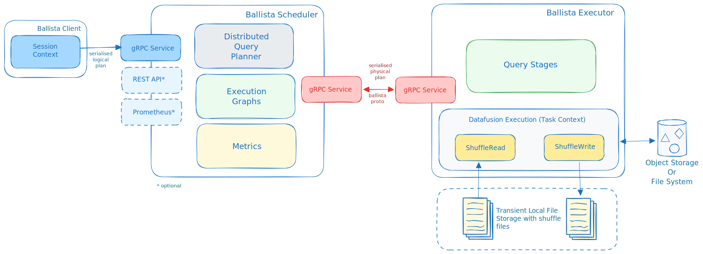

<!---
  Licensed to the Apache Software Foundation (ASF) under one
  or more contributor license agreements.  See the NOTICE file
  distributed with this work for additional information
  regarding copyright ownership.  The ASF licenses this file
  to you under the Apache License, Version 2.0 (the
  "License"); you may not use this file except in compliance
  with the License.  You may obtain a copy of the License at

    http://www.apache.org/licenses/LICENSE-2.0

  Unless required by applicable law or agreed to in writing,
  software distributed under the License is distributed on an
  "AS IS" BASIS, WITHOUT WARRANTIES OR CONDITIONS OF ANY
  KIND, either express or implied.  See the License for the
  specific language governing permissions and limitations
  under the License.
-->

# Ballista Architecture

## Overview

Ballista’s primary purpose is to provide a distributed SQL query engine implemented in the Rust programming
language and using the Apache Arrow memory model.

Ballista also provides a DataFrame API (both in Rust and Python), suitable for constructing ETL pipelines and
analytical queries. The DataFrame API is inspired by Apache Spark and is currently better suited for ETL/SQL work
than for data science.

## Design Principles

### Arrow-native

Ballista uses the Apache Arrow memory format during query execution, and Apache Arrow IPC format on disk for
shuffle files and for exchanging data between executors. Queries can be submitted using the Arrow Flight SQL API
and the Arrow Flight SQL JDBC Driver.

### Language Agnostic

Although most of the implementation code is written in Rust, the scheduler and executor APIs are based on open
standards, including protocol buffers, gRPC, Apache Arrow IPC, and Apache Arrow Flight SQL.

This language agnostic approach will allow Ballista to eventually support UDFs in languages other than Rust,
including Wasm.

### Extensible

Many Ballista users have their own distributed query engines that use Ballista as a foundation, rather than
using Ballista directly. This allows the scheduler and executor processes to be extended with support for
additional data formats, operators, expressions, or custom SQL dialects or other DSLs.

Ballista uses the DataFusion query engine for query execution, but it should be possible to plug in other execution
engines.

## Deployment Architecture

### Cluster

A Ballista cluster consists of one or more scheduler processes and one or more executor processes. These processes
can be run as native binaries and are also available as Docker Images, which can be easily deployed with
[Docker Compose](https://datafusion.apache.org/ballista/user-guide/deployment/docker-compose.html) or
[Kubernetes](https://datafusion.apache.org/ballista/user-guide/deployment/kubernetes.html).

The following diagram shows the interaction between clients and the scheduler for submitting jobs, and the interaction
between the executor(s) and the scheduler for fetching tasks and reporting task status.



### Scheduler

The scheduler provides the following interfaces:

- gRPC service for submitting and managing jobs
- Flight SQL API
- REST API for monitoring jobs

Jobs are submitted to the scheduler's gRPC service from a client context, either in the form of a logical query
plan or a SQL string. The scheduler then creates an execution graph, which contains a physical plan broken down into
stages (pipelines) that can be scheduled independently. This process is explained in detail in the Distributed
Query Scheduling section of this guide.

### Executor

The executor processes connect to a scheduler and poll for tasks to perform. These tasks are physical plans in
protocol buffer format. These physical plans are typically executed against multiple partitions of input data. Executors
can execute multiple partitions of the same plan in parallel.

### Clients

There are multiple clients available for submitting jobs to a Ballista cluster:

- The [Ballista CLI](https://github.com/apache/datafusion-ballista/tree/main/ballista-cli) provides a SQL command-line
  interface.
- The Python bindings ([PyBallista](https://github.com/apache/datafusion-ballista/tree/main/python)) provide a session
  context with support for SQL and DataFrame operations.
- The [ballista crate](https://crates.io/crates/ballista) provides a native Rust session context with support for
  SQL and DataFrame operations.
- The [Flight SQL JDBC driver](https://arrow.apache.org/docs/java/flight_sql_jdbc_driver.html) can be used from
  popular SQL tools to execute SQL queries against a cluster.

## Distributed Query Scheduling

Distributed query plans are fundamentally different to in-process query plans because we can't just build a
tree of operators and start executing them. The query now requires co-ordination across executors which means that
we now need a scheduler.

At a high level, the concept of a distributed query scheduler is not complex. The scheduler needs to examine the
whole query and break it down into stages that can be executed in isolation (usually in parallel across the executors)
and then schedule these stages for execution based on the available resources in the cluster. Once each query
stage completes then any subsequent dependent query stages can be scheduled. This process repeats until all query
stages have been executed.

### Producing a Distributed Query Plan

Some operators can run in parallel on input partitions and some operators require data to be repartitioned. These
changes in partitioning are key to planning a distributed query. Changes in partitioning within a plan are sometimes
called pipeline breakers and these changes in partitioning define the boundaries between query stages.

We will now use the following SQL query to see how this process works.

```sql
SELECT customer.id, sum(order.amount) as total_amount
FROM customer JOIN order ON customer.id = order.customer_id
GROUP BY customer.id
```

The physical (non-distributed) plan for this query would look something like this:

```
Projection: #customer.id, #total_amount
  HashAggregate: groupBy=[customer.id], aggr=[SUM(order.amount) AS total_amount]
    Join: condition=[customer.id = order.customer_id]
      Scan: customer
      Scan: order
```

Assuming that the customer and order tables are not already partitioned on customer id, we will need to schedule
execution of the first two query stages to repartition this data. These two query stages can run in parallel.

```
Query Stage #1: repartition=[customer.id]
  Scan: customer
Query Stage #2: repartition=[order.customer_id]
  Scan: order
```

Next, we can schedule the join, which will run in parallel for each partition of the two inputs. The next operator
after the join is the aggregate, which is split into two parts; the aggregate that runs in parallel and then
the final aggregate that requires a single input partition. We can perform the parallel part of this aggregate
in the same query stage as the join because this first aggregate does not care how the data is partitioned. This
gives us our third query stage, which can now be scheduled for execution. The output of this query stage
remains partitioned by customer id.

```
Query Stage #3: repartition=[]
  HashAggregate: groupBy=[customer.id], aggr=[SUM(order.amount) AS total_amount]
    Join: condition=[customer.id = order.customer_id]
      Query Stage #1
      Query Stage #2
```

The final query stage performs the aggregate of the aggregates, reading from all of the partitions from the previous
stage.

```
Query Stage #4:
  Projection: #customer.id, #total_amount
    HashAggregate: groupBy=[customer.id], aggr=[SUM(order.amount) AS total_amount]
      QueryStage #3
```

To recap, here is the full distributed query plan showing the query stages that are introduced when data needs to be
repartitioned or exchanged between pipelined operations.

```
Query Stage #4:
  Projection: #customer.id, #total_amount
    HashAggregate: groupBy=[customer.id], aggr=[SUM(order.amount) AS total_amount]
      Query Stage #3: repartition=[]
        HashAggregate: groupBy=[customer.id], aggr=[SUM(order.amount) AS total_amount]
          Join: condition=[customer.id = order.customer_id]
            Query Stage #1: repartition=[customer.id]
              Scan: customer
            Query Stage #2: repartition=[order.customer_id]
              Scan: order
```

### Shuffle

Each stage of the execution graph has the same partitioning scheme for all of the operators in the plan. However,
the output of each stage typically needs to be repartitioned before it can be used as the input to the next stage. An
example of this is when a query contains multiple joins. Data needs to be partitioned by the join keys before the join
can be performed.

Each executor will re-partition the output of the stage it is running so that it can be consumed by the next
stage. This mechanism is known as an Exchange or a Shuffle. The logic for this can be found in the [ShuffleWriterExec]
and [ShuffleReaderExec] operators.

[shufflewriterexec]: https://github.com/apache/datafusion-ballista/blob/main/ballista/core/src/execution_plans/shuffle_writer.rs
[shufflereaderexec]: https://github.com/apache/datafusion-ballista/blob/main/ballista/core/src/execution_plans/shuffle_reader.rs
