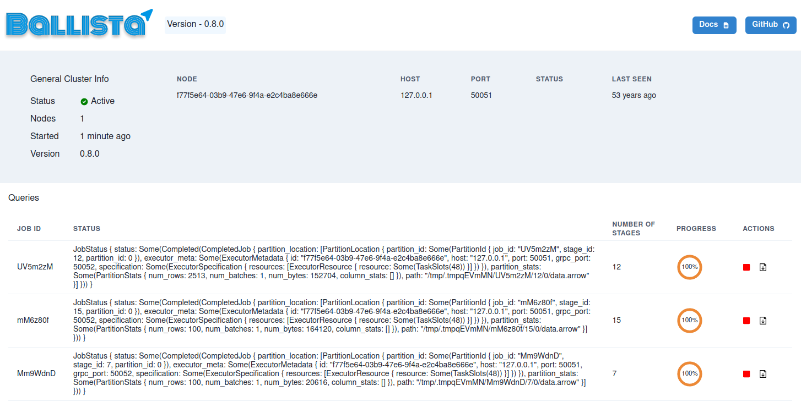

<!---
  Licensed to the Apache Software Foundation (ASF) under one
  or more contributor license agreements.  See the NOTICE file
  distributed with this work for additional information
  regarding copyright ownership.  The ASF licenses this file
  to you under the Apache License, Version 2.0 (the
  "License"); you may not use this file except in compliance
  with the License.  You may obtain a copy of the License at

    http://www.apache.org/licenses/LICENSE-2.0

  Unless required by applicable law or agreed to in writing,
  software distributed under the License is distributed on an
  "AS IS" BASIS, WITHOUT WARRANTIES OR CONDITIONS OF ANY
  KIND, either express or implied.  See the License for the
  specific language governing permissions and limitations
  under the License.
-->

# Overview

Ballista is a distributed compute platform primarily implemented in Rust, and powered by Apache Arrow.

Ballista has a scheduler and an executor process that are standard Rust executables and can be executed directly, but
Dockerfiles are provided to build images for use in containerized environments, such as Docker, Docker Compose, and
Kubernetes. See the [deployment guide](deployment.md) for more information

SQL and DataFrame queries can be submitted from Python and Rust, and SQL queries can be submitted via the Arrow
Flight SQL JDBC driver, supporting your favorite JDBC compliant tools such as [DataGrip](datagrip)
or [tableau](tableau). For setup instructions, please see the [FlightSQL guide](flightsql.md).

The scheduler has a web user interface for monitoring query status as well as a REST API.

## How does this compare to Apache Spark?

Although Ballista is largely inspired by Apache Spark, there are some key differences.

- The choice of Rust as the main execution language means that memory usage is deterministic and avoids the overhead
  of GC pauses.
- Ballista is designed from the ground up to use columnar data, enabling a number of efficiencies such as vectorized
  processing (SIMD and GPU) and efficient compression. Although Spark does have some columnar support, it is still
  largely row-based today.
- The combination of Rust and Arrow provides excellent memory efficiency and memory usage can be 5x - 10x lower than
  Apache Spark in some cases, which means that more processing can fit on a single node, reducing the overhead of
  distributed compute.
- The use of Apache Arrow as the memory model and network protocol means that data can be exchanged between executors
  in any programming language with minimal serialization overhead.

[deployment](./deployment)
[datagrip](https://www.jetbrains.com/datagrip/)
[tableau](https://help.tableau.com/current/pro/desktop/en-us/examples_otherdatabases_jdbc.htm)
